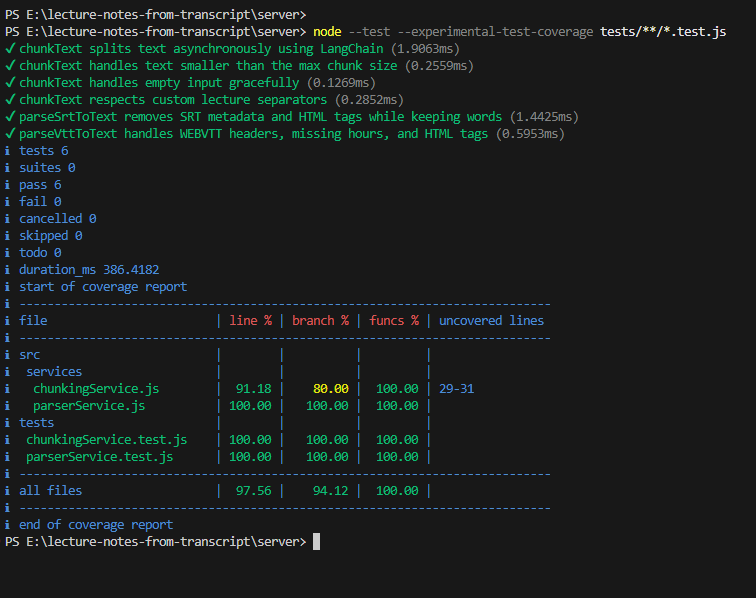
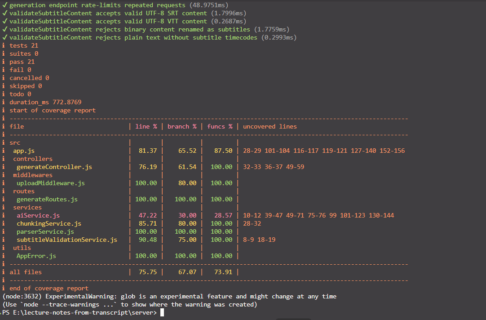

# Lecture Companion

> Turn messy lecture subtitle files into clean, structured Markdown study notes.


[GitHub](https://github.com/devChathura/lecture-notes-from-transcript) |
[Parser article](https://medium.com/@nozerochathura/building-a-stateless-subtitle-parser-in-node-js-extracting-clean-text-from-srt-and-vtt-files-d978d6c3b34c) |
[Portfolio](https://chathura-hapukotuwa.netlify.app/) |
[LinkedIn](https://www.linkedin.com/in/chathura-hapukotuwa/)

## Overview

Lecture Companion is a full-stack AI study tool that converts `.srt` and `.vtt`
lecture subtitle files into readable Markdown study notes.

Subtitle files are useful for video playback but difficult to revise from. They
contain timestamps, sequence numbers, formatting tags, repeated spacing, and
long blocks of unstructured text. Lecture Companion cleans that input, splits
long transcripts into manageable chunks, and uses Google Gemini to create
headings, summaries, key ideas, and terminology.

I built this project to learn how to take a product from an idea to a
production-ready implementation. The work includes product design, frontend
development, backend architecture, AI integration, validation, security,
testing, and deployment preparation.

## From Idea to Production

I built Lecture Companion to solve a lecture revision problem I faced myself:
turning messy subtitle transcripts into clear study notes took too much time. I
used that problem as an opportunity to design and build a complete software
product:

- Defined the problem, target users, MVP scope, constraints, and success
  criteria before implementation.
- Designed a client-server architecture that separates presentation, file
  processing, and AI orchestration.
- Built a custom subtitle-processing pipeline instead of sending raw files
  directly to the model.
- Considered long-input handling through recursive chunking and overlap.
- Designed the public demo around API quota constraints without removing the
  real backend workflow.
- Added validation, failure states, rate limiting, safe configuration, and
  production-focused error handling.
- Documented the architecture with C4 context, container, and component
  diagrams.
- Added automated tests for parsing, chunking, upload validation, API behavior,
  rate limiting, CORS, and production configuration.

The project reflects the full path from identifying a problem to designing,
building, testing, documenting, and preparing a product for deployment.

## Product Screenshots

### Landing Page


### Generated Notes


## Key Features

### Product

- Polished landing page and separate `/try` experience
- Drag-and-drop `.srt` and `.vtt` uploads
- Client and server file validation
- Structured Markdown study-guide generation
- Responsive Markdown preview
- Copy notes to the clipboard
- Download notes as a `.md` file
- Restore the latest generated notes after a refresh
- Public sample mode that demonstrates the complete output flow
- Friendly loading, success, restored, and error states

### Engineering

- Custom SRT/VTT parsing and transcript cleanup pipeline
- In-memory file processing with Multer
- Recursive chunking with 4,000-character chunks and 400-character overlap
- Gemini 2.5 Flash orchestration
- Client-server separation that keeps the Gemini key on the backend
- Public demo mode that does not call Gemini
- Production live-generation kill switch
- Endpoint rate limiting and transcript-size limits
- Restricted production CORS and security headers
- Safe provider timeout and error handling
- Targeted backend security and validation tests

## Demo and Live Modes

### Public Demo Mode

```env
VITE_DEMO_MODE=true
```

Public demo mode:

- Loads a bundled sample lecture and generated study guide
- Does not call the backend generation endpoint
- Does not consume Gemini API quota
- Supports Markdown preview, copy, download, and browser restore
- Keeps file selection and validation available for demonstrating the UI

### Full Backend Mode

```env
# client/.env.local
VITE_DEMO_MODE=false
VITE_API_BASE_URL=/api/v1
```

```env
# server/config.env
GEMINI_API_KEY=your_gemini_api_key_here
ENABLE_LIVE_GENERATION=true
```

Full backend mode uploads the subtitle file to Express, validates and cleans the
content, chunks the transcript, calls Gemini, and returns generated Markdown.

## How It Works

1. The user uploads one `.srt` or `.vtt` file up to 5 MB.
2. The backend validates the extension, MIME hint, UTF-8 content, and subtitle
   timecodes.
3. The parser removes timestamps, sequence numbers, tags, and formatting noise.
4. The cleaned transcript is divided into overlapping chunks and capped at a
   configured maximum length.
5. The chunks are combined with clear boundaries for one Gemini synthesis
   request.
6. The user previews, copies, downloads, or restores the notes.

## Architecture

```text
React /try page
      |
      | multipart/form-data
      v
Express API
      |
      v
Upload validation
      |
      v
SRT/VTT parser -> cleanup -> chunking
      |
      v
Google Gemini
      |
      v
Markdown study guide
```

### Frontend

- Landing page and `/try` product page
- Demo-mode sample generation
- File selection and validation UI
- Upload, processing, result, error, and restored states
- Markdown rendering, copying, and downloading
- Safe `localStorage` persistence

### Backend

- Express REST API
- In-memory upload handling
- Subtitle content validation
- SRT/VTT parsing and cleanup
- Transcript chunking
- Gemini orchestration
- Rate limiting, CORS, security headers, and safe errors

Architecture diagrams:

- [System context](docs/diagrams/c4_context_diagram.svg)
- [Container diagram](docs/diagrams/c4_container_diagram.svg)
- [Component diagram](docs/diagrams/c4_component_diagram.svg)

## Engineering Decisions

| Decision                                       | Implementation                                                                                                                           | Reason                                                                                                     |
| ---------------------------------------------- | ---------------------------------------------------------------------------------------------------------------------------------------- | ---------------------------------------------------------------------------------------------------------- |
| **Separate client and server**                 | React manages the user experience while Express handles file processing and Gemini requests.                                             | Keeps UI concerns separate from backend processing and prevents API credentials from reaching the browser. |
| **Keep the API stateless**                     | Uploaded files are processed in memory and are not stored by the server.                                                                 | Reduces data-retention risk and keeps each generation request independent.                                 |
| **Parse before AI processing**                 | SRT and VTT files pass through format-aware validation and transcript cleanup before generation.                                         | Removes subtitle noise, gives Gemini cleaner input, and keeps parsing independently testable.              |
| **Segment long transcripts**                   | Clean text is split recursively into 4,000-character chunks with 400-character overlap, then combined for one bounded synthesis request. | Creates consistent transcript sections while the controller-level character limit bounds provider input.   |
| **Support demo and live modes**                | The frontend can load bundled sample notes or use the complete backend workflow.                                                         | Demonstrates the product without consuming public Gemini quota while retaining the real implementation.    |
| **Keep operational safeguards on the backend** | Express owns upload limits, transcript limits, CORS, rate limiting, provider timeouts, and error mapping.                                | Applies controls at the system boundary even when client-side validation is bypassed.                      |

## Documentation

The repository records the thinking behind the implementation:

- [Product definition](docs/phase-1.md) covers the problem statement, target
  users, MVP scope, requirements, constraints, and user flow.
- [System architecture](docs/phase-2-architecture.md) documents the
  client-server design, data flow, and architecture decisions.
- [C4 diagrams](docs/diagrams) show the system context, containers, and backend
  components.
- [Security audit report](docs/security-audit-report.md) explains the threat
  model, implemented safeguards, verification, and remaining risks.
- [Parser pipeline article](https://medium.com/@nozerochathura/building-a-stateless-subtitle-parser-in-node-js-extracting-clean-text-from-srt-and-vtt-files-d978d6c3b34c)
  explains the subtitle parsing problem and implementation approach.

## Local Setup

### Prerequisites

- Node.js 22.12 or newer
- npm
- A Google Gemini API key for live generation

### Clone

```bash
git clone https://github.com/devChathura/lecture-notes-from-transcript.git
cd lecture-notes-from-transcript
```

### Backend

```bash
cd server
npm install
```

Create the environment file:

```powershell
# Windows PowerShell
Copy-Item config.env.example config.env
```

```bash
# macOS/Linux
cp config.env.example config.env
```

Update `server/config.env`:

```env
PORT=5001
NODE_ENV=development
GEMINI_API_KEY=your_gemini_api_key_here
ENABLE_LIVE_GENERATION=true
CORS_ORIGIN=http://localhost:5173
TRUST_PROXY_HOPS=0
RATE_LIMIT_WINDOW_MS=900000
RATE_LIMIT_MAX=10
MAX_TRANSCRIPT_CHARACTERS=200000
AI_REQUEST_TIMEOUT_MS=120000
```

Start the server:

```bash
npm run dev
```

### Frontend

Open another terminal:

```bash
cd client
npm install
```

Create `client/.env.local`:

```env
VITE_DEMO_MODE=false
VITE_API_BASE_URL=/api/v1
```

Start the client:

```bash
npm run dev
```

Open `http://localhost:5173/try`.

## API

| Endpoint           | Method | Description                                              |
| ------------------ | ------ | -------------------------------------------------------- |
| `/api/health`      | `GET`  | Checks whether the Express API is running                |
| `/api/v1/generate` | `POST` | Validates a subtitle file and returns generated Markdown |

## Testing

The backend includes 21 native Node.js tests covering the parsing pipeline,
chunking, upload validation, API safeguards, and production configuration.

```bash
cd server
npm test
npm run test:coverage
```

Current backend source coverage is **75.75% lines**, **67.07% branches**, and
**73.91% functions**. The parser and upload middleware have 100% line coverage.

### Coverage Snapshots

The earlier focused parser/chunking suite reached **94.12% branch coverage**
across the files loaded by that six-test run:



The current report covers the expanded 21-test backend suite and filters the
summary to application source files:



## Current Limitations

- Public demo mode uses bundled sample notes instead of live Gemini generation.
- Live generation requires the backend and a Gemini API key.
- Only UTF-8 `.srt` and `.vtt` files are supported.
- Output quality depends on transcript quality.
- Only the latest generated result is stored in the browser.
- Audio/video ingestion and YouTube transcript fetching are not implemented.

## Related Write-up

[Building a Stateless Subtitle Parser in Node.js: Extracting Clean Text from SRT and VTT Files](https://medium.com/@nozerochathura/building-a-stateless-subtitle-parser-in-node-js-extracting-clean-text-from-srt-and-vtt-files-d978d6c3b34c)

## License

This project is licensed under the [ISC License](LICENSE).

## Author

**Chathura Hapukotuwa**

- [GitHub](https://github.com/devChathura)
- [Portfolio](https://chathura-hapukotuwa.netlify.app/)
- [LinkedIn](https://www.linkedin.com/in/chathura-hapukotuwa/)
- [Medium](https://medium.com/@nozerochathura)
