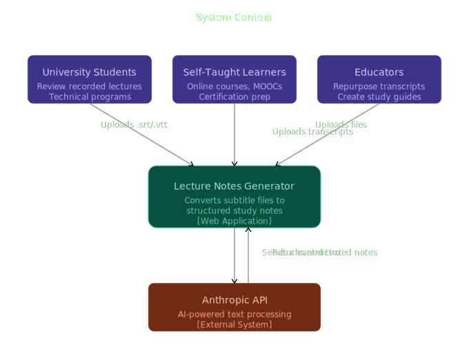
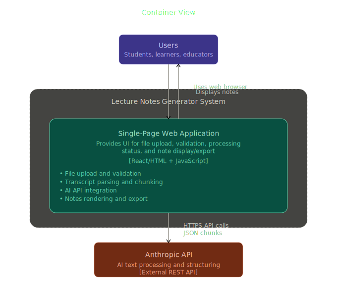

# Phase 2: System Architecture & Design

## 1. C4 Model Diagrams

**Level 1: System Context**
The high-level view of how users interact with the AI Lecture Companion and how it relies on external intelligence.

**Level 2: Container Diagram**
Focuses on the high-level technology choices and the communication between the client and server.

**Level 3: Component Diagram (Backend API)**
A deep dive into the internal logic of the Node.js server.

## 2. Decision Took

| Decision      | Selection       | Justification                                                                                                                                                          |
| :------------ | :-------------- | :--------------------------------------------------------------------------------------------------------------------------------------------------------------------- |
| Pattern       | Client-Server   | Separates UI concerns from heavy text processing. Protects sensitive API keys (cannot expose LLM API keys in the frontend code) from being exposed on the client-side. |
| State         | Stateless API   | The server does not store files or session data. This makes the system easier to scale and reduces the security risk of storing user data.                             |
| Backend       | Node.js/Express | Easiness of handling asynchronous I/O tasks and wiring different services. Ideal for processing text streams.                                                          |
| Communication | JSON/REST       | Standard, lightweight, and easy to debug. Allows the frontend to remain decoupled from the backend implementation.                                                     |

## 3. Data Flow

- **Ingestion**: Frontend validates file type and sends the .srt via a multi-part form request.
- **Sanitization**: The Transcript Parser uses Regular Expressions to strip timestamps, sequence numbers, and HTML styling.
- **Segmentation**: The Chunking Engine breaks the clean text into 4000-character segments with a 10% overlap to preserve context.
- **Synthesis**: The AI Orchestrator sends segments to the LLM with a specific system prompt.
- **Delivery**: The Output Formatter aggregates responses into a single Markdown string and returns it to the UI.

## 4. API Design (Contracts)

<!-- todo -->

//Not yet decided

## 5. Core Intelligence Strategies

### A. Chunking Strategy: Sliding Window

To prevent the AI from losing context when a sentence is split between two requests, planning to use a Sliding Window.

- **Chunk Size**: ~4,000 characters.
- **Overlap**: 400 characters.
- **Why**: This ensures that if the end of Chunk A introduces a concept, Chunk B has enough context to understand how that concept continues.

### B. Prompt Strategy: Role-Based Engineering

We utilize a "System Persona" to enforce output reliability.

- **Persona**: Senior Academic Teaching Assistant.
- **Instruction**: "Extract key technical terms and explain them simply. Use hierarchical Markdown headings. Do not include time-stamps in the output."
- **Format Enforcement**: "Output ONLY valid Markdown. No conversational filler."

<!-- Should allow user to add their custom prompts / needs as well -->

## 6. Security & Error Handling

- **Rate Limiting**: Prevent API abuse using express-rate-limit.
- **Input Sanitization**: Ensure the parser handles malformed or malicious text inputs without crashing.
- **Graceful Failure**: If the AI API times out, the system returns a 504 Gateway Timeout with a user-friendly message rather than a raw code error.

## 7. Tech Stack

**Frontend (Client-Side)**

- **React (via Vite):** Chosen for its robust component-based architecture, making it easy to manage state for file uploads, loading indicators, and displaying dynamic results. Vite provides a significantly faster development and build experience.
- **Tailwind CSS**
- **React Markdown:** Essential for safely and accurately rendering the Markdown content generated by the AI Orchestrator into styled HTML elements for the user.

**Backend (Server-Side)**

- **Node.js:** Its asynchronous, non-blocking I/O model is perfect for handling the text processing, file parsing, and external API requests (to the LLM) required by this system.
- **Express.js**
- **Multer:** For receiving the uploaded `.srt` files from the frontend.

**AI Integration & Utilities**

<!-- todo -->

- **Tokenization Library:**
- **express-rate-limit:**

## 8. Folder Strcuture

<!-- NOT YET IMPLEMENTED -->
