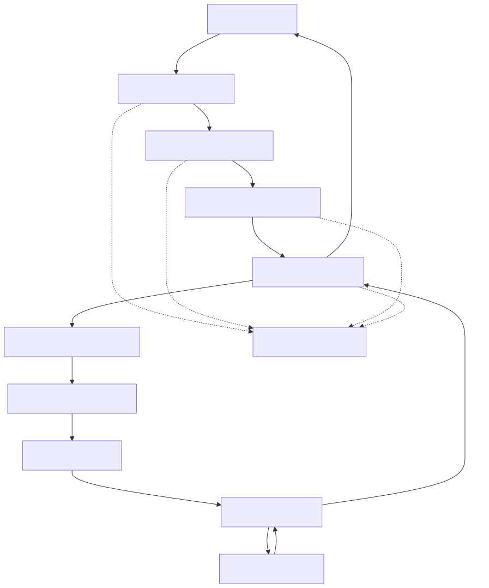

# Phase 2: System Architecture and Design

## 1. Architecture Goals

Lecture Companion is designed around one focused workflow: convert a subtitle
file into a readable Markdown study guide without exposing provider credentials
or permanently storing the uploaded transcript.

The architecture prioritizes:

- Clear separation between the React client and Express API
- Stateless, in-memory request processing
- Independent subtitle validation, parsing, chunking, and AI services
- Explicit limits around uploaded and cleaned transcript content
- A public sample mode that does not consume Gemini quota
- Testable service boundaries and production-safe failure behavior

## 2. C4 Model Diagrams

### Level 1: System Context

Shows the learner, Lecture Companion, and the external Gemini service.


### Level 2: Container Diagram

Shows the React/Vite frontend, Node.js/Express API, and Gemini integration.


### Level 3: Backend Components

Shows the main backend processing components from request handling through
Markdown generation.



## 3. Architectural Decisions

| Decision                        | Implementation                                                                                                                      | Reason                                                                              |
| ------------------------------- | ----------------------------------------------------------------------------------------------------------------------------------- | ----------------------------------------------------------------------------------- |
| Client-server separation        | React owns presentation and browser state; Express owns subtitle processing and Gemini communication.                               | Keeps provider credentials and processing rules outside the browser.                |
| Stateless API                   | Multer keeps one uploaded file in memory for the lifetime of the request.                                                           | Avoids permanent transcript storage and keeps requests independent.                 |
| Service-oriented pipeline       | Validation, parsing, chunking, and AI orchestration live in separate modules.                                                       | Makes each processing stage easier to test and change independently.                |
| Backend-enforced validation     | The API checks extension, MIME hint, UTF-8 content, binary markers, timecodes, file count, and size.                                | Client validation can be bypassed and is not a security boundary.                   |
| Bounded transcript input        | Cleaned text is limited by `MAX_TRANSCRIPT_CHARACTERS`.                                                                             | Prevents unexpectedly large provider requests and limits quota exposure.            |
| Dual runtime modes              | `VITE_DEMO_MODE` selects bundled sample generation; the backend uses `ENABLE_LIVE_GENERATION` as a separate live-generation switch. | Preserves a public product demonstration without requiring anonymous Gemini access. |
| Browser-only result persistence | The latest Markdown result and safe file metadata are stored in `localStorage`.                                                     | Restores work after refresh without adding accounts or a database.                  |

## 4. Runtime Modes

### Public Demo Mode

When `VITE_DEMO_MODE=true`, the frontend loads a bundled sample lecture and
pre-generated Markdown. The generation API and Gemini are not called.

The demo still exercises:

- The generated-notes layout
- Copy and Markdown download actions
- Browser persistence and restore behavior
- Source metadata and reset actions

### Full Backend Mode

When `VITE_DEMO_MODE=false`, the frontend sends the selected file to
`POST /api/v1/generate`.

The backend generation route is available when:

- Development has not explicitly disabled live generation, or
- Production sets `ENABLE_LIVE_GENERATION=true`

## 5. Request and Data Flow

1. **Select:** The user selects one `.srt` or `.vtt` file on `/try`.
2. **Client validation:** The browser checks the extension and 5 MB limit.
3. **Submit:** Axios sends `multipart/form-data` using the field name `file`.
4. **Deployment gate:** Express checks whether live generation is enabled.
5. **Rate limit:** The generation endpoint applies the configured request limit.
6. **Upload validation:** Multer uses memory storage and enforces file, part, and
   size limits.
7. **Content validation:** The backend verifies the extension, MIME hint, UTF-8
   decoding, absence of null bytes, and expected subtitle timecodes.
8. **Parsing:** The SRT or VTT parser removes timestamps, sequence metadata,
   tags, and repeated line breaks.
9. **Transcript limit:** The controller rejects cleaned text above
   `MAX_TRANSCRIPT_CHARACTERS`.
10. **Segmentation:** `RecursiveCharacterTextSplitter` creates
    4,000-character chunks with 400-character overlap.
11. **Synthesis:** The current AI service joins the chunks with separators and
    sends one bounded source-transcript prompt to Gemini 2.5 Flash.
12. **Delivery:** Express returns the generated Markdown and request metadata.
13. **Presentation:** React renders the Markdown and enables copy/download
    actions.
14. **Persistence:** The client stores the latest Markdown and validated file
    metadata locally for refresh recovery.

## 6. Component Responsibilities

### Frontend

| Component        | Responsibility                                                                                          |
| ---------------- | ------------------------------------------------------------------------------------------------------- |
| `LandingPage`    | Presents the product, workflow, engineering highlights, CTA, and footer.                                |
| `TryPage`        | Coordinates file selection, demo/live modes, generation, errors, result state, and browser persistence. |
| `FileUploader`   | Provides accessible drag-and-drop selection and client-side type/size validation.                       |
| `MarkdownViewer` | Renders Markdown and provides copy and `.md` download actions.                                          |
| `apiService`     | Builds the multipart request and calls the configured API prefix.                                       |
| `demoStudyGuide` | Stores the bundled sample metadata and Markdown used in public demo mode.                               |

### Backend

| Component                   | Responsibility                                                                                         |
| --------------------------- | ------------------------------------------------------------------------------------------------------ |
| `app.js`                    | Configures Express, CORS, Helmet, request limits, generation gating, rate limiting, and global errors. |
| `uploadMiddleware`          | Receives one in-memory subtitle file and applies upload metadata/size limits.                          |
| `subtitleValidationService` | Decodes UTF-8 content and verifies that it resembles the declared subtitle format.                     |
| `generateController`        | Coordinates validation, parsing, transcript limits, chunking, AI generation, and the response.         |
| `parserService`             | Removes SRT/VTT playback metadata and formatting tags.                                                 |
| `chunkingService`           | Splits cleaned text recursively using configured chunk size and overlap.                               |
| `aiService`                 | Configures Gemini, prompt boundaries, retries, timeout behavior, and provider error mapping.           |
| `AppError`                  | Represents expected operational errors with HTTP status codes.                                         |

## 7. API Contract

### Health

- `GET /api/health`
- Returns API availability as JSON

### Generate Study Guide

- `POST /api/v1/generate`
- Content type: `multipart/form-data`
- File field: `file`
- Accepted formats: `.srt`, `.vtt`
- Maximum upload size: 5 MB

Successful responses contain:

- `status`
- Original file name
- Generated chunk count
- Markdown study guide

## 8. AI Orchestration

The AI service uses `gemini-2.5-flash` with:

- A system instruction that defines the Markdown study-guide structure
- A clear `SOURCE_TRANSCRIPT_START` / `SOURCE_TRANSCRIPT_END` boundary
- Explicit treatment of transcript content as untrusted source material
- Low-temperature generation for more consistent structure
- Up to three attempts for transient provider failures
- Exponential backoff with jitter
- A configurable provider timeout
- Safe 502, 503, and 504 error mapping

The current implementation performs one synthesis request after recombining the
segmented transcript. A future multi-pass summarization strategy could process
chunks independently before a final merge if larger inputs require it.

## 9. Security and Failure Boundaries

- Gemini credentials are read only by the backend.
- Production generation defaults to disabled unless explicitly enabled.
- Production CORS accepts configured origins and otherwise fails closed.
- Upload and transcript limits are enforced before Gemini is called.
- The generation endpoint is rate-limited.
- Helmet adds standard HTTP security headers.
- Express framework fingerprinting is disabled.
- Production responses hide stack traces and unexpected internal details.
- Development retains restricted diagnostic output.
- Uploaded transcript bodies are not logged in normal operation.

The full implementation and threat model are documented in
[the security audit report](./security-audit-report.md).

## 10. Testing Strategy

Native Node.js tests cover:

- SRT and VTT parsing
- Recursive chunking behavior
- UTF-8 and subtitle timecode validation
- Binary, unsupported, missing, and oversized uploads
- Cleaned transcript-size limits
- Security headers and configured CORS behavior
- Production live-generation defaults
- Endpoint rate limiting
- Safe behavior when Gemini is not configured

Run:

```bash
cd server
npm test
npm run test:coverage
```

The current suite contains 21 passing tests. The source-only coverage report is
75.75% lines, 67.07% branches, and 73.91% functions.

## 11. Tradeoffs and Current Limitations

- Public demo mode uses a bundled result rather than live AI generation.
- The server does not provide authentication or per-user generation history.
- Browser persistence stores only the latest result.
- The actual uploaded `File` object cannot be restored after a refresh.
- Only UTF-8 `.srt` and `.vtt` files are supported.
- AI output quality depends on transcript quality.
- Chunk segmentation currently feeds one combined synthesis request rather than
  a multi-stage map/reduce process.
- Audio/video transcription and direct YouTube ingestion are outside the
  current scope.
